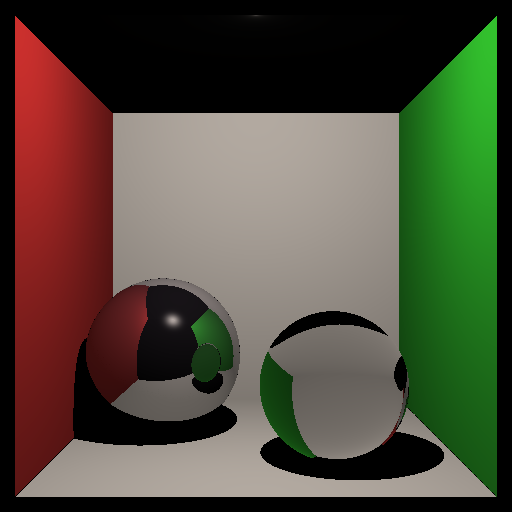
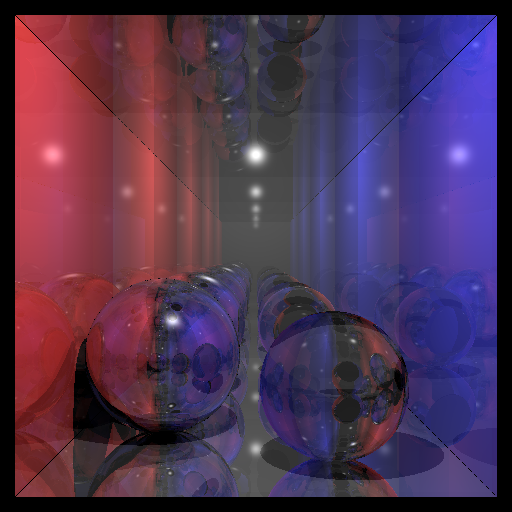
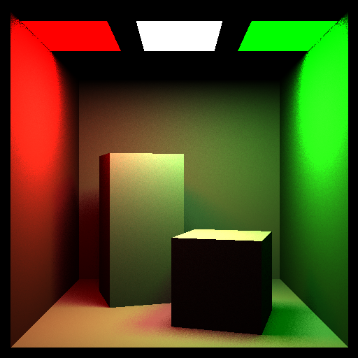
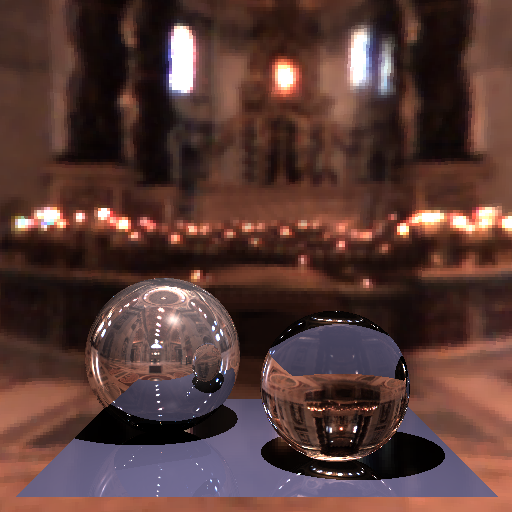
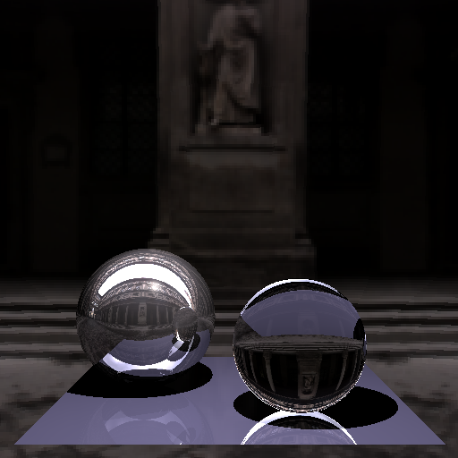

# SGL (Simple Graphics Library)

A custom implementation of the Simple Graphics Library (SGL) - a 2D/3D graphics library with support for both rasterization and ray tracing rendering techniques.

## Overview

This project implements the SGL library specification, providing a comprehensive graphics API similar to OpenGL but simplified for educational purposes. The implementation includes both traditional rasterization-based rendering and advanced ray tracing capabilities.

**Important Note**: The original authors (Jaroslav Sloup, Jaroslav Krivanek, Jiri Bittner) provided only the `sgl.h` header file with the API specification. All other files in this repository represent our complete implementation of the SGL library functionality.

## Features

### Core Graphics Features
- **2D/3D Rendering**: Support for points, lines, triangles, and polygons
- **Transformations**: Modelview and projection matrices with stack operations
- **Drawing Primitives**: Circles, ellipses, arcs, and custom polygons
- **Color Management**: RGB color specification and buffer management
- **Depth Testing**: Z-buffer implementation for 3D rendering

### Advanced Rendering
- **Ray Tracing**: Full ray tracing implementation with:
  - Sphere primitives
  - Phong lighting model (diffuse + specular)
  - Point lights and area lights
  - Material properties (diffuse, specular, shininess)
  - Transparency and refraction (IOR support)
  - Environment mapping
- **Rasterization**: Traditional rasterization-based rendering

### Scene Management
- **Scene Description**: Begin/End scene specification
- **Primitive Management**: Add and manage geometric primitives
- **Lighting**: Point lights and emissive materials for area lights
- **Materials**: Surface material properties with Phong model

## Project Structure

```
CustomSGL/
├── include/
│   ├── sgl.h          # Main SGL API header
│   └── enums.h        # Enumerations and constants
├── src/
│   ├── sgl.cpp        # Main library entry point
│   ├── context.cpp    # Drawing context management
│   ├── scene.cpp      # Scene and primitive management
│   ├── draw.cpp       # Basic drawing functions
│   ├── draw_utils.cpp # Drawing utilities and algorithms
│   ├── transformation.cpp # Matrix transformations
│   ├── ray_tracing.cpp # Ray tracing implementation
│   ├── ray_tracing_utils.cpp # Ray tracing utilities
│   ├── lightingModels.cpp # Lighting calculations
│   ├── structures.cpp # Data structures
│   ├── attribute_functions.cpp # Color and attribute functions
│   ├── error_handling.cpp # Error management
│   └── initialize.cpp # Library initialization
├── results/           # Generated test images
└── CMakeLists.txt     # Build configuration
```

## Building the Library

### Prerequisites
- CMake 3.8 or higher
- C++ compiler with C++11 support

### Build Instructions

```bash
# Create build directory
mkdir build
cd build

# Configure and build
cmake ..
make

# Install (optional)
make install
```

## Test Results

The library has been tested with various scenes demonstrating different rendering capabilities:

### Generated Images

  
*Shadows, simple reflections and refractions*

  
*Multiple reflections and refractions*

  
*Implemetation of area light sources*

  
*Implementation of environment mapping*

  
*Implementation of environment mapping*

## API Reference

The library provides a comprehensive API similar to OpenGL:

### Context Management
- `sglInit()` / `sglFinish()` - Library initialization/cleanup
- `sglCreateContext()` / `sglDestroyContext()` - Context management
- `sglSetContext()` / `sglGetContext()` - Context selection

### Drawing Functions
- `sglBegin()` / `sglEnd()` - Primitive specification
- `sglVertex2f()` / `sglVertex3f()` / `sglVertex4f()` - Vertex specification
- `sglCircle()`, `sglEllipse()`, `sglArc()` - Geometric primitives

### Transformations
- `sglMatrixMode()` - Matrix stack selection
- `sglLoadIdentity()`, `sglLoadMatrix()`, `sglMultMatrix()` - Matrix operations
- `sglTranslate()`, `sglScale()`, `sglRotate2D()`, `sglRotateY()` - Transformations
- `sglOrtho()`, `sglFrustum()` - Projection matrices
- `sglViewport()` - Viewport transformation

### Attributes and Materials
- `sglColor3f()` - Drawing color
- `sglMaterial()` - Surface material properties
- `sglEmissiveMaterial()` - Emissive materials for area lights
- `sglAreaMode()` - Fill mode specification

### Scene and Rendering
- `sglBeginScene()` / `sglEndScene()` - Scene specification
- `sglSphere()` - Sphere primitive
- `sglPointLight()` - Point light source
- `sglRayTraceScene()` / `sglRasterizeScene()` - Rendering methods
- `sglEnvironmentMap()` - Environment mapping

### Error Handling
- `sglGetError()` - Get current error code
- `sglGetErrorString()` - Get error description

## Implementation Details

### Rendering Pipeline
The library supports two main rendering approaches:

1. **Rasterization**: Traditional scanline-based rendering with depth testing
2. **Ray Tracing**: Physically-based rendering with support for:
   - Primary and secondary rays
   - Shadow rays for lighting
   - Reflection and refraction
   - Environment mapping

### Memory Management
- Automatic memory management for contexts and buffers
- No memory leaks (verified during development)
- Efficient data structures for scene representation

### Performance Considerations
- Optimized ray-sphere intersection tests
- Efficient matrix operations
- Adaptive subdivision for curved primitives

## Authors

- **API Specification**: Jaroslav Sloup, Jaroslav Krivanek, Jiri Bittner (CTU Prague) - provided the `sgl.h` header file
- **API Modificatios**: Jakub Hendrich, Daniel Meister (CTU Prague)
- **Current Implementation**: Martina Muroňová, Natálie Kaslová (CTU Prague) - complete library implementation

## License

This implementation is part of an educational project at Czech Technical University in Prague.

## Contributing

This is an educational implementation. For questions or issues related to the SGL specification, please refer to the original documentation.

